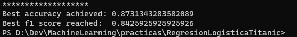

# Titanic Logist Regression

## Kaggle Data set
**https://www.kaggle.com/c/titanic/data**

## Logist Regression Results

As you can see i got 84% of F1 accuracy which is very good considering that i'm 
using a simple Logist Regression algorithm
so lets i'll try to generate a new model
using SVM o DNN to make a more complex 
limite desicion.

 